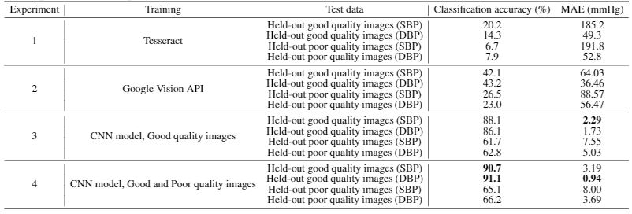

# CNN-based LCD Transcription of Blood Pressure from a Mobile Phone Camera

This repository contains the source code for the system presented in the research paper titled [CNN-based LCD Transcription of Blood Pressure from a Mobile Phone Camera](https://arxiv.org/abs/2030.12345)submitted to the Frontiers Artificial Intelligence - Medicine and Public Health Sp. Ed on Reimagining Health Systems: leveraging AI/ML for Low- and Middle-Income Countries (LMICs)(in review) 

 
## Installation instructions:
```install
git clone https://github.com/cliffordlab/BPimageTranscribe.git
```

### Requirements

To install requirements:

```setup
pip install -r code/requirements.txt
```
This can be done either directly in the cloned repository or by setting up an [Anaconda](https://docs.conda.io/projects/conda/en/latest/user-guide/tasks/manage-environments.html) or Python [virtualenv](https://virtualenv.pypa.io/en/stable/user_guide.html) environment

## Description of scripts:
Once installed, the user can navigate to the code directory for executing the scripts as discussed below using:
```
cd code/
```
- [helper_functions.py](code/helper_functions.py): Functions used in preprocessing of input images like gamma adjustment, conversion of images to arrays and single monitor contour extraction. 
- [CNN_model.py](code/CNN_model.py): Defines the CNN model architecture & contains functions to generate and evaluate the model trained on binary single monitor frames.
- [gen_trained_model.py](code/gen_trained_model.py): Given a set of input BP meter images of varying quality in a directory, this script preprocesses them to extract single monitor LCDs in binary thresholded format as well as generates and saves a CNN model trained on these preprocessed images. 
- [transcribe_image.py](code/transcribe_image.py): This script is used to preprocess and transcribe unknown BP meter images under test into numerical format.
 
## Training

To generate the training dataset as well as saved the best CNN transcription model trained on them as described in the paper, you will need to input the source images' drectory location containing the input images(.jpg) and a labels(.csv) file saving its ground truth labels for numerical value & quality. As discussed in the paper, the source images will be released eventually, but presently cannot be released unless every single one is checked for protected health information and redactions performed. This includes dates on the devices, reflections of people’s faces, fingerprints on screens, fingers in shot, etc. Even in ‘clean’ data there are often some such personal information. 

- Input: 
    1. Dataset/data/: Folder consisting of input RGB BP meter images
    2. Dataset/labels.csv: File storing LCD numerical and quality data for each image (Format: filename | SBP | DBP | quality)

Once provided, run this command:

```train
python3 gen_trained_model.py
```
This will generate intermediate output folder to save binary thresholded single monitor frames(.jpg) and its corresponding ground truth labels(.csv) file. Using this files, 
- Intermediary Output:
    1. Dataset/training_data/frames_BP/ : Folder to save preprocessed binary thresholded single monitor frames as training data 
    2. Dataset/training_data/frame_labels.csv: File(.csv) saving LCD numerical and quality data for each single monitor frame

On completion, it will save the best trained CNN model (Dataset/training_data/best_model.h5) as well as model performance plots(.png) in the Dataset/training_data/

## Pre-trained Models

You can find the pretrained model described in the paper here:

- [Image_Digitization model]() : Trained on 5022 single monitor binary images and validated on 1677 single monitor binary images. 

## Testing
The trained model can be used to transcribe a held-out set of BP meter images of varying quality under test. A sample set of similar images is provided [here](Test_case/test_data/). Using the transcribe_image.py, run this command:
```test
python3 transcribe_image.py
```
Every test image in the folder will be preprocessed creating intermediary binary thresholded single monitor LCD frames (Test_case/results/frames_BP/). The trained CNN model will be used to transcribe these preprocessed images into numerical values saved as Test_case/results/test_data_predictions.csv(Format: filename | predicted_SBP| predicted_DBP)

## Results

Below table shows comparison of performance of our model with popular and publicly available OCR engine like Tesseract and Google API as baseline, all of which are trained on the dataset described in the study:



## Contributing

